# Claude Memory Sync System


A lightweight, automated memory sync system that gives Claude persistent context across devices and sessions. Runs silently in the background. Zero manual steps after setup.

---

## The Problem

Claude starts every session from scratch. No project history, no context, no idea what you were building yesterday. For someone running multiple AI agents across multiple projects on two laptops, that's a real productivity killer -- every session wastes 10-15 minutes re-establishing context.

## The Solution

Structured JSON context files stored locally, synced to end-to-end encrypted cloud storage every 30 minutes, with a Python API layer that generates smart startup briefs via the Claude API. When you start a new session, Claude already knows where you left off.

**This system complements Claude's native memory -- it doesn't replace it.** Claude's built-in memory is a 24-hour summarization layer. This is a structured, portable, encrypted backup system you own. Both work together.

---

## Architecture

```
┌─────────────────────────────────────────────────────────┐
│                      Claude AI                          │
│              (startup context injected)                 │
└──────────────┬──────────────────────┬───────────────────┘
               │ api_sync context     │ api_sync context
               ▼                      ▼
┌──────────────────────┐   ┌──────────────────────────────┐
│  MSI GE73VR          │   │  ThinkPad T480               │
│  (primary machine)   │   │  (travel machine)            │
│                      │   │                              │
│  claude_sync.py      │   │  claude_sync.py              │
│  heartbeat + context │   │  heartbeat + context         │
│                      │   │                              │
│  claude_api_sync.py  │   │  claude_api_sync.py          │
│  reads memory,       │   │  reads memory,               │
│  calls Claude API    │   │  calls Claude API            │
│                      │   │                              │
│  systemd + cron      │   │  systemd + cron              │
│  auto-start on boot  │   │  auto-start on boot          │
│                      │   │                              │
│  ~/Desktop/          │   │  ~/Desktop/                  │
│  claude-memory/      │   │  claude-memory/              │
└──────────┬───────────┘   └──────────────┬───────────────┘
           │ rclone push (1x a day)    │ rclone pull (1x a day)
           ▼                              ▲
           ┌──────────────────────────────┤
           │       Proton Drive           │
           │  (E2E encrypted cloud sync)  │
           └──────────────────────────────┘
```

**MSI GE73VR** -- primary daily driver. Pushes memory up to Proton Drive 1x a day.  
**ThinkPad T480** -- travel machine. Pulls down from Proton Drive 1x a day.  
**Proton Drive** -- encrypted cloud layer in the middle. No plain text ever hits the cloud.  
**api_sync** -- reads local memory files, calls Claude API, generates startup context brief.



**Interactive diagrams -- open in browser for full detail:**

- [Full System Architecture](https://htmlpreview.github.io/?https://github.com/BrentlBowers/claude-memory-sync/blob/main/claude_memory_system_full_architecture.html)
- [Data Flow Diagram](https://htmlpreview.github.io/?https://github.com/BrentlBowers/claude-memory-sync/blob/main/claude_memory_sync_data_flow.html)

---

## How It Works

| Component | What it does |
|-----------|-------------|
| `claude_sync.py` | Runs continuously via systemd. Writes heartbeat and context files every 30 min. |
| `claude_api_sync.py` | Reads memory files, calls Claude API to generate startup context, logs session summaries. |
| rclone + cron | Syncs `~/Desktop/claude-memory/` to Proton Drive 1x a day. MSI pushes up, ThinkPad pulls down. |
| systemd | Auto-starts both scripts on boot. Fully hands-off after setup. |
| `.env` (chmod 600) | API key stored locally only. Never synced to cloud. Never committed to git. |

---

## File Structure

```
~/Desktop/claude-memory/
├── memory/        # Core context files -- owner info, heartbeat, session summaries
├── projects/      # Per-project state -- one JSON file per project
├── experiments/   # Experiment logs and prompt test results
└── logs/          # Sync activity logs from Python scripts and rclone
```

---

## Requirements

- Linux (Ubuntu 22.04+ or Mint 22+)
- Python 3.10+
- rclone v1.73+
- Proton Drive account
- Anthropic API key with credits

---

## Install

### 1. Python environment

```bash
python3 -m venv ~/claude-sync-venv
source ~/claude-sync-venv/bin/activate
pip install anthropic watchdog schedule python-dotenv
```

### 2. Memory folder structure

```bash
mkdir -p ~/Desktop/claude-memory/{memory,projects,experiments,logs}
```

### 3. API key

```bash
echo "ANTHROPIC_API_KEY=your_key_here" > ~/claude-sync-venv/.env
chmod 600 ~/claude-sync-venv/.env
```

### 4. rclone + Proton Drive

```bash
sudo -v ; curl https://rclone.org/install.sh | sudo bash
rclone config
# Add Proton Drive as a remote named "proton"

rclone mkdir proton:claude-memory
rclone sync ~/Desktop/claude-memory/ proton:claude-memory --protondrive-replace-existing-draft=true
```

### 5. systemd service

Create `/etc/systemd/system/claude-sync.service`:

```ini
[Unit]
Description=Claude Memory Sync
After=network.target

[Service]
Type=simple
User=YOUR_USERNAME
WorkingDirectory=/home/YOUR_USERNAME
ExecStart=/home/YOUR_USERNAME/claude-sync-venv/bin/python /home/YOUR_USERNAME/claude-sync-venv/claude_sync.py
Restart=on-failure
RestartSec=10

[Install]
WantedBy=multi-user.target
```

```bash
sudo systemctl daemon-reload
sudo systemctl enable claude-sync
sudo systemctl start claude-sync
```

### 6. Cron jobs

**Machine 1 (push up):**
```
*/30 * * * * /usr/bin/rclone sync /home/YOUR_USERNAME/Desktop/claude-memory/ proton:claude-memory --protondrive-replace-existing-draft=true --config /home/YOUR_USERNAME/.config/rclone/rclone.conf --log-file=/home/YOUR_USERNAME/Desktop/claude-memory/logs/rclone.log
```

**Machine 2 (pull down):**
```
*/30 * * * * /usr/bin/rclone sync proton:claude-memory /home/YOUR_USERNAME/Desktop/claude-memory/ --protondrive-replace-existing-draft=true --config /home/YOUR_USERNAME/.config/rclone/rclone.conf --log-file=/home/YOUR_USERNAME/Desktop/claude-memory/logs/rclone.log
```

> **Important -- don't skip these two flags:**
>
> 1. Always use the full `/usr/bin/rclone` path, not just `rclone`. Cron runs in a stripped environment and may not find the binary otherwise.
> 2. Always include `--config /home/YOUR_USERNAME/.config/rclone/rclone.conf`. Without it, cron can't find your stored Proton auth token and re-authenticates on every sync cycle -- which triggers repeated "new login" security alerts on your phone and creates phantom sessions in your Proton account. Adding the config flag fixes this completely.

---

## Usage

```bash
# Generate startup context for a project
python ~/claude-sync-venv/claude_api_sync.py context ai_lab

# Log what you worked on
python ~/claude-sync-venv/claude_api_sync.py log ai_lab "what we worked on today"

# Update project state
python ~/claude-sync-venv/claude_api_sync.py update ai_lab "project notes" "task1,task2"
```

---

## Security

- API key lives in a local `.env` file with `chmod 600` -- never synced, never committed
- All Proton Drive data is end-to-end encrypted by Proton
- No sensitive personal data stored in memory files
- `.env` is in `.gitignore` -- see `.env.example` for the required format
- Memory files contain project context only -- no passwords, no health data, no financials

---

## Design Decisions

**Why not build a custom chat interface?**  
Anthropic ships native persistent memory and actively improves claude.ai. Building a local replacement would sacrifice mobile access, artifacts, voice mode, web search, and everything else that makes Claude useful. This system stops at the structured backup layer -- maximum value, zero technical debt.

**Why Proton Drive?**  
End-to-end encryption by default. No extra configuration needed to keep your context private.

**Why rclone + systemd + cron instead of a custom daemon?**  
Standard Linux tools. Reliable, well-documented, and won't break when dependencies update.

---

## Built With

- Python 3 + `schedule` + `anthropic` SDK
- rclone + Proton Drive
- systemd + cron
- Linux Mint 22 and Ubuntu 22.04

---

## License

MIT -- see [LICENSE](LICENSE) for details.

Built by [Brent Bowers](https://github.com/BrentlBowers) with Claude AI -- April 2026.
